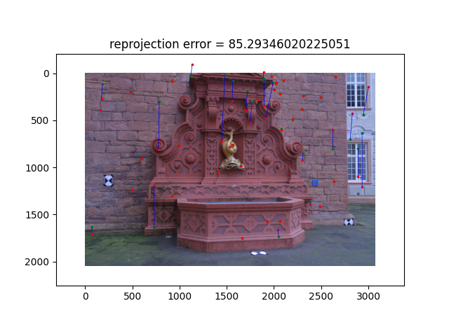

# Structure-from-Motion (SfM) Implementation Report

## Introduction

Structure-from-Motion (SfM) is a technique used to reconstruct a 3D structure from a set of 2D images. The main idea behind SfM is to estimate the camera poses and 3D point coordinates simultaneously from a collection of overlapping images.

## Overview of the Logic

Here's an overview of the main components and flow of our SfM implementation:

1. Feature Extraction:
    * Extract SIFT features and descriptors from the input images.
2. Feature Matching:
    * Match the features between each pair of images using their descriptors.
3. Pose Estimation:
    * Estimate the camera poses using the matched feature points.
    * Calculate the fundamental matrix (F) and essential matrix (E).
    * Derive the relative rotation (R) and translation (t) between camera poses.
4. Triangulation:
    * Triangulate the 3D points using the corresponding feature points and camera poses.
5. Bundle Adjustment:
    * Optimize the 3D points and camera poses to minimize the reprojection error.
6. Point Cloud Generation:
    * Merge the optimized 3D points into the point cloud.
7. Reprojection Error Evaluation:
    * Calculate the reprojection error for each image.
    * Visualize the reprojection error by plotting the differences.
    * Display the average reprojection error across all images.
8. Repeat 3 ~ 7 for each new images

## Feature Extraction and Matching (feat_match.py given)

The first step in the SfM pipeline is feature extraction. The given skeleton code use the SIFT (Scale-Invariant Feature Transform) algorithm to extract features and their descriptors from the input images. SIFT works by blurring the image at different scales and detecting the maximum or minimum highlighted spots as keypoints. The scale at which the keypoint is detected determines its magnitude. The descriptor is then created by computing a histogram of gradient vectors from the patch around each keypoint.

Once the features and descriptors are extracted, it perform feature matching by comparing the descriptors of each image pair. This step helps in identifying corresponding points across different images.

## Pose Estimation (sfm.py given)

The next step is pose estimation, which involves calculating the camera poses for each image. The given skeleton code estimate the epipolar geometry using the fundamental matrix (F) computed from the matched feature points. The fundamental matrix encodes the geometric relationship between two views. From the fundamental matrix, it calculate the essential matrix (E) using the camera intrinsic matrix (K). The essential matrix is used to extract information about the relative rotation (R) and translation (t) between the two camera poses.

## Triangulation and Bundle Adjustment (sfm.py TODO Implementaion & Extra Credit)

After estimating the camera poses, it needs to triangulate the 3D points using the corresponding feature points from two images. Triangulation is the process of determining the 3D coordinates of a point by intersecting the rays from the camera poses through the corresponding image points.

Before adding the triangulated 3D points to the point cloud, bundle adjustment is placed. Bundle adjustment is an optimization process that minimizes the reprojection error by adjusting the 3D point coordinates and camera poses. It refines the initial estimates to obtain a more accurate and consistent reconstruction.

Once the bundle adjustment is complete, it needs to merge the optimized 3D points into the point cloud.

## Reprojection Error Evaluation (sfm.py & util.py TODO Implementation)

To assess the quality of the reconstruction, it needs to evaluate the reprojection error. The reprojection error measures the difference between the projected 3D points and their corresponding 2D feature points in the images.

The mean Euclidean distance between the ground truth feature points and the reprojected points is calculated. In cases where the error values are out of bounds or invalid, I treated them as the maximum possible error within the image size.

Additionally, I visualized the reprojection error by plotting the differences between the ground truth and the reprojected points using blue lines. Sampled ground truth points are colored green with slightly larger size to make sure it is not covered, and sampled reprojected points are colored red. This helps in understanding the distribution and magnitude of the errors.

Finally, the skeleton code display the average reprojection error across all images to provide an overall measure of the reconstruction quality.

## Error Visual Results

### Due to long time for bundle adjustment calculation below did not complete execute bundle adjustment

## Reprojection Erros

* Baseline Cameras 0000, 0001: Pose Estimation [time=0.0335s]
* Baseline Cameras 0000, 0001: Baseline Triangulation [time=1.06e+02s]
* Camera 0000: Reprojection Error = 0.4900080458313982
* Camera 0001: Reprojection Error = 0.4788756693171282
* Camera 0002: Pose Estimation [time=0.102s]
* Camera 0002: Triangulation [time=1.4e+03s]
* Camera 0002: Reprojection Error = 70.60677164155385
* Camera 0003: Pose Estimation [time=0.154s]
* Camera 0003: Triangulation [time=1.33e+03s]
* Camera 0003: Reprojection Error = 80.89401550473481
* Camera 0004: Pose Estimation [time=0.219s]
* Camera 0004: Triangulation [time=9.46e+02s]
* Camera 0004: Reprojection Error = 99.38326992578419
* Camera 0005: Pose Estimation [time=0.249s]
* Camera 0005: Triangulation [time=1.34e+03s]
* Camera 0005: Reprojection Error = 76.14648290201258
* Camera 0006: Pose Estimation [time=0.296s]
* Camera 0006: Triangulation [time=1.15e+03s]
* Camera 0006: Reprojection Error = 85.29346020225051

### Due to long time for bundle adjustment calculation below did not complete execute bundle adjustment

* Camera 0007: Pose Estimation [time=0.286s]
* Camera 0007: Triangulation [time=0.182s]
* Camera 0007: Reprojection Error = 96.27109388752876
* Camera 0008: Pose Estimation [time=0.4s]
* Camera 0008: Triangulation [time=0.218s]
* Camera 0008: Reprojection Error = 202.36644939845203
* Camera 0009: Pose Estimation [time=0.527s]
* Camera 0009: Triangulation [time=0.341s]
* Camera 0009: Reprojection Error = 295.1054354171853
* Camera 0010: Pose Estimation [time=0.686s]
* Camera 0010: Triangulation [time=0.347s]
* Camera 0010: Reprojection Error = 861.3783253299299
* Reconstruction Completed: Mean Reprojection Error = 175.91545254091125 [t=4.49219s], Results stored in ./assets/assignment2/results/